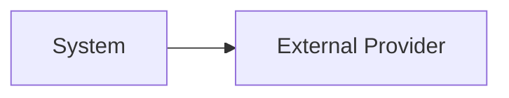

# Integration Map

| Integration | Purpose | Direction | Protocol | Sync/Async | Criticality | Owner | Failure Strategy |
|---|---|---|---|---|---|---|---|
|  |  | Inbound/Outbound | REST/Webhook/Event/Batch |  | Low/Medium/High/Critical |  |  |

## Integration Diagram

## Failure Modes

| Failure | Impact | Detection | Mitigation |
|---|---|---|---|
|  |  |  |  |
